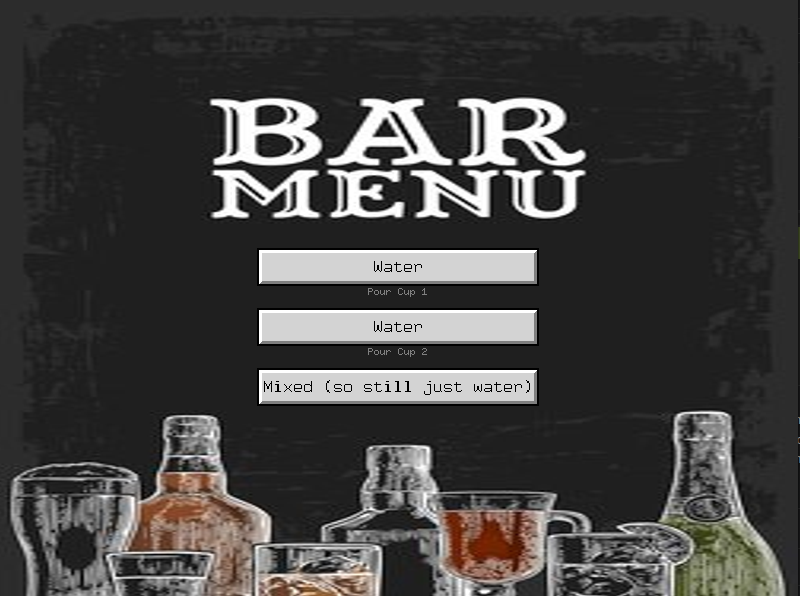
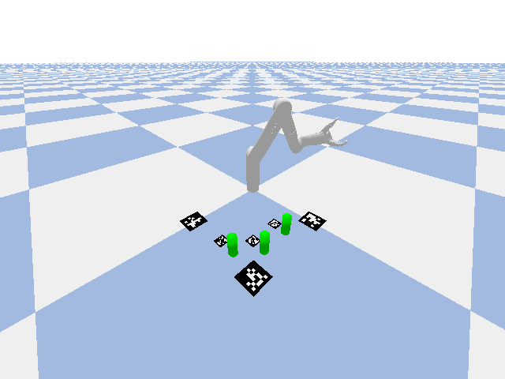

# Bartender Bot
This is the bartender bot repository, as part of the FunRobo 2026 final project. For this project, our goal was to use the Kinova Gen3 Lite robot arm along with an Intel RealSense camera to detect a can and a cup using fiducial markers, pick up the can, pour it into the cup, and set it back down. Our MVP was to complete this process with one can and one cup, using fiducial markers for every key item, though we have expanded partially past that with this current, more refined and capable iteration.

When ran, the Kinova initially moves to its home position, out of the way, before the realsense camera above begins it's camera calibration. Using three fiducial markers with known locations on the three corners of the workspace not occupied by the base of the arm, the camera calculates its transform matrix to the world frame. It is then able to detect any other fiducial markers, calculate their positions in the world frame, and use those positions to determine the final positions of their associated object (ingredient, fill cup, etc...).

One these positions have been finalized, the user is then prompted with an interface for commanding the arm. The three options available are to pour from the first pour cup into the fill cup, pour from the second pour cup into the fill cup, or pour both pour cups into the fill cup. 



Upon choosing an option the interface disappears and the arm completes a queue of actions, completing the given command. After finishing the final command the interface is reopened and new commands can be sent. The gif below is the mix command being executed within our simulator.



The current bartender bot is capable of interacting with two ingredient / pour cups, and one output / fill cup. However, the setup is built to easily enable increasing both of these. 

## Bartender Bot Files

This section contains descriptions the files that are either new or changed past the initial Kinova code

#### main.py
Contains main control loop for Bartender Bot. 

#### camera.py
Contains camera classes for both simulator and realsense cameras.

#### camera_calibration.py
Self-contained class used for saving pictures for camera calibration.

#### kinematics_helpers.py
Contains all forward and inverse kinematics functions used for bartender bot.

#### trajectory_classes.py
Contains all trajectory generation functions and classes used for bartender bot. (mostly unused as current IK has 2 steps and therefore no actual trajectory)

#### ui_helpers.py
Contains helper functions for the user interface of bartender bot.

#### kinova.py
Only changes from starter Kinova code are the addition of the `create_ball()`, `create_cup()`, and `create_apriltag()` functions which are used to create their respective object in the simulator.

---

The setup for the 6DOF arm can be found below.

# KINOVA Arm Documentation
## Physical Setup - 6DOF

The 6DOF KINOVA arm should already be installed on a table in the back of the classroom. Before turning it on, check the following:

- The micro-usb cable is plugged into the back of the robot arm and the usb is in your computer
- The power supply brick is plugged into the arm
- The arm is clear of any obstacles that might damage it

Once all of the above are verified, turn on the robot arm by switching the switch to the ON position.

---

### Linux

**Step 1.** Open **Settings** and go to **Network**. Click the gear icon next to the wired connection.


**Step 2.** Go to the **IPv4** tab. Set the method to **Manual** and enter the following:

- **Address:** `192.168.1.11`
- **Netmask:** `255.255.255.0`


**Step 3.** Click **Apply**.

---

## Communication Setup - 6DOF

Since we are using USB connection, the arm automatically handles all communication setup.

---

## Computational Setup

### Install UV

This codebase uses UV as its Python environment manager. UV is similar to conda, but faster and easier to use.

**Windows:**

```powershell
powershell -ExecutionPolicy ByPass -c "irm https://astral.sh/uv/install.ps1 | iex"
```

**Linux:**

```bash
curl -LsSf https://astral.sh/uv/install.sh | sh
```

---

### Codebase Setup

First, fork the `kinova-control-system` repo from GitHub, then clone it:

```bash
git clone https://github.com/<username>/kinova-control-system
```

Set up the Python environment with UV:

```bash
uv sync
```

This will install everything automatically. Once it is done, activate the virtual environment:

```bash
source .venv/bin/activate
```

To verify that everything worked correctly, run:

```bash
python -m backend.kinova
```

> **NOTE:** This will only work if you are inside the UV virtual environment. Your terminal prompt should show `(kinova-control-system)`. If it does not, either activate the environment using the command above or run `uv run python -m backend.kinova` instead.

> **NOTE:** This will only work if you are physically connected to the KINOVA robot. Follow the Physical and Communication Setup sections above first.

The expected output is:

```
Testing Environment...

Environment is ready to go

Have fun using the Kinova Robot Arm!
```

---

## Simulation Mode

You can run the codebase in simulation using PyBullet without connecting to a real robot. Pass `simulate=True` and a `urdf_path` to `Main()`:

```python
# 6DOF simulation
final_project = Main(simulate=True, urdf_path="visualizer/6dof/urdf/6dof.urdf")
```

A PyBullet window will open showing the robot. This is a good way to test your joint angle sequences before running them on the real hardware.

> **NOTE:** The simulation runs at 240Hz internally but your `loop()` still runs at whatever `loop_rate` you set. The arm movement speed in simulation is capped at roughly 60 degrees/second to match real-world behavior.

## Bartender Bot Specific Instructions

Non-pip installations below:

```bash
sudo apt install python3-tk
sudo apt install librealsense2-dkms librealsense2-utils
```

In order to actually run bartender bot, once connected to arm (or set to simulation), simply run `main.py`.